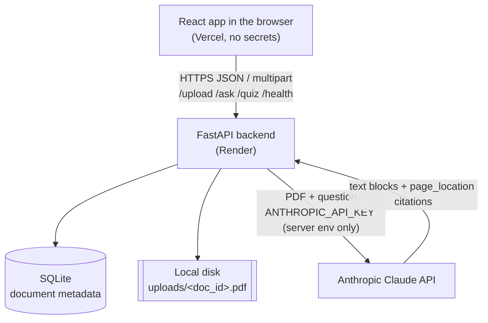

# StudyBuddy AI

An AI study assistant for your own lecture notes. Upload a PDF of notes or slides, ask questions and get
answers **grounded only in that PDF with page citations**, then test yourself with an AI-generated
5-question practice quiz.

Built with React + TypeScript (Vite), FastAPI, SQLite, and the Anthropic Claude API.

> **Live demo:** https://studybuddy-ai-liart.vercel.app · **API:** https://studybuddy-ai-api-0s4q.onrender.com/health · **Demo video:** _coming soon_
>
> The free Render backend sleeps when idle, so the first request after a while can take 30–60 seconds.

---

## Features

- **PDF upload**: drag & drop or file picker, with size/type validation, progress, and clear errors.
- **Cited Q&A**: ask anything about your notes; each part of the answer shows chips like `p. 4` or
  `p. 4–5` taken straight from Claude's citation metadata.
- **Honest answers**: the model is told to say when your notes don't cover a question instead of guessing.
- **Practice quiz**: 5 multiple-choice questions, one at a time, with instant feedback, explanations,
  and a final score. Retry the same quiz or generate a new one.
- **Polished UI**: responsive (phone to laptop), light/dark mode, keyboard accessible, screen-reader
  labels, visible focus states.
- **Cost guards**: upload size and page limits, question length limit, per-IP rate limiting, request
  timeouts, duplicate-click protection, and prompt caching of the PDF.

## Screenshots

_Screenshots coming soon (upload screen, cited answer, quiz results)._

## Architecture



The browser never sees the Anthropic API key. It only talks to the FastAPI backend, which is the only
component that holds `ANTHROPIC_API_KEY` (from an environment variable).

## Tech stack

| Layer    | Technology |
|----------|------------|
| Frontend | React 19, TypeScript, Vite, plain CSS (design tokens), Vitest + Testing Library, oxlint |
| Backend  | Python 3.11+ (tested on 3.13), FastAPI, Uvicorn, Pydantic v2, python-multipart, python-dotenv, pypdf |
| AI       | Anthropic Python SDK, Claude Haiku 4.5 (`claude-haiku-4-5-20251001`, configurable) |
| Database | SQLite via the standard library, behind a repository class |
| Hosting  | Render (backend), Vercel (frontend) |

## Project structure

```
studybuddy-ai/
├── backend/
│   ├── app/
│   │   ├── main.py              # app factory: CORS, error handlers, routers
│   │   ├── config.py            # all environment variables, read in one place
│   │   ├── errors.py            # AppError + {"error": {code, message}} responses
│   │   ├── dependencies.py      # FastAPI dependency providers, rate-limit hook
│   │   ├── models/document.py   # Document dataclass
│   │   ├── schemas/             # Pydantic request/response models
│   │   ├── db/                  # SQLite connection + DocumentRepository (only SQL lives here)
│   │   ├── services/
│   │   │   ├── document_service.py  # upload validation, lookup
│   │   │   ├── storage_service.py   # safe local file storage
│   │   │   ├── claude_service.py    # all Anthropic API calls
│   │   │   ├── citation_parser.py   # Claude citations -> {"parts": [...]}
│   │   │   └── quiz_parser.py       # strict JSON extraction + validation
│   │   ├── routes/              # health, documents (/upload), ask, quiz
│   │   └── utils/               # pdf helpers, in-memory rate limiter
│   ├── tests/                   # pytest suite (Claude is always mocked)
│   ├── requirements.txt / requirements-dev.txt
│   └── .env.example
├── frontend/
│   ├── src/
│   │   ├── components/          # UploadCard, ChatPanel, CitationChip, QuizPanel, ...
│   │   ├── pages/StudyPage.tsx  # top-level state and flow
│   │   ├── services/api.ts      # every backend call goes through here
│   │   ├── types/               # API + UI types
│   │   └── utils/               # page-range formatting, file validation
│   ├── vercel.json
│   └── .env.example
├── render.yaml                  # Render Blueprint for the backend
├── CLAUDE.md                    # guide for AI coding sessions
└── PROJECT_STATUS.md
```

## How document Q&A works

1. `POST /upload` checks the file (PDF extension or MIME type, `%PDF-` magic bytes, size limit, readable
   by `pypdf`, not encrypted, page limit). It stores it as `uploads/<random-uuid>.pdf` and records the
   metadata in SQLite. The original filename is kept only as display metadata.
2. `POST /ask` validates the question, loads the PDF, and sends Claude a single message containing the
   PDF as a base64 `document` block with `citations: {enabled: true}`, followed by the question.
3. A system prompt tells Claude to answer only from the document, cite every claim, say when the notes
   don't cover something, keep it concise and student-friendly, and ignore instructions inside the PDF.
4. The document block has `cache_control`, so repeat questions about the same PDF within a few minutes
   reuse the cached document tokens (cheaper and faster). Very short documents fall below the model's
   minimum cacheable size and simply aren't cached.

There's no vector database or chunking. For lecture-sized PDFs, sending the whole document is simpler
and lets Claude cite pages directly.

## How citations work

With citations enabled, Claude returns its answer as several `text` blocks. Blocks that make a claim
from the document carry `citations`. For PDFs, each citation is a `page_location` with
`start_page_number` (1-indexed) and `end_page_number` (**exclusive**).
`services/citation_parser.py` converts this into:

```json
{
  "parts": [
    { "text": "A stack is last-in, first-out.", "pages": [4] },
    { "text": " A queue is first-in, first-out.", "pages": [5, 6] }
  ]
}
```

Page numbers come **only** from the API's citation metadata and are never guessed from the text.
Whitespace-only blocks are merged into their neighbours, and stray Markdown (`**bold**`, `# headings`) is
stripped because the UI renders plain text. The frontend groups contiguous pages into
chips (`p. 5–6`). `CitationChip` already accepts an optional `onSelect` handler, so chips can later
become buttons that open the PDF at that page.

## How quiz generation works

1. `POST /quiz` sends the PDF (without citations) with a system prompt asking for **only** a JSON object:
   exactly 5 questions, each with 4 distinct options, a `correct_answer` copied exactly from the options,
   and a short explanation.
2. `services/quiz_parser.py` extracts the JSON (tolerating code fences or a stray sentence) with
   `json.loads` (never `eval`) and validates it with Pydantic: 5 questions, 4 non-blank distinct
   options, and a correct answer that is one of the options.
3. If validation fails, the service retries **once**, sending back the model's reply plus a correction
   message that describes exactly what was wrong. If the retry also fails, the API returns a clean
   `502 ai_malformed_response`.
4. Options are shuffled server-side, since models tend to put the right answer first.

The frontend shows one question at a time and reveals the answer and explanation only after the student
checks their choice.

## Security design

- `ANTHROPIC_API_KEY` is read only from the backend environment (`config.py`). It is never sent to the
  browser, logged, or returned (`/health` only reports a boolean `ai_configured`). The settings object
  hides the key from its `repr`.
- `.env` files are gitignored; only `.env.example` templates are committed.
- Uploaded files are stored under generated UUID names. User filenames are sanitized and used only for
  display. `doc_id` must match a 32-character hex pattern before any lookup, and the storage layer
  refuses paths outside the upload directory.
- API responses never include filesystem paths. Errors use a consistent
  `{"error": {"code", "message"}}` shape. Stack traces go to the server log only.
- CORS allows only the origins listed in `ALLOWED_ORIGINS`, with no credentials, and only `GET`/`POST`.
- The system prompt tells Claude to treat instructions inside the PDF as content (a prompt-injection guard).

## Local installation

Requirements: Python 3.11+ and Node.js 20.19+ (tested with Python 3.13 and Node 24).

### Backend setup

```bash
cd backend
python3 -m venv .venv
source .venv/bin/activate            # Windows: .venv\Scripts\activate
pip install -r requirements-dev.txt
cp .env.example .env                 # then set ANTHROPIC_API_KEY in .env
uvicorn app.main:app --reload --port 8000
```

Check it: `curl http://localhost:8000/health` returns `{"status":"ok","ai_configured":true}`.
Interactive API docs are at http://localhost:8000/docs.

Without an API key the app still runs: uploads work, and `/ask` and `/quiz` return a clear
`503 ai_not_configured` error.

### Frontend setup

```bash
cd frontend
npm install
cp .env.example .env.local           # VITE_API_BASE_URL=http://localhost:8000
npm run dev                          # http://localhost:5173
```

## Environment variables

**Backend** (`backend/.env`, or the Render dashboard):

| Variable | Default | Purpose |
|---|---|---|
| `ANTHROPIC_API_KEY` | none (**required** for AI) | Anthropic API key. Keep it server-side only |
| `ANTHROPIC_MODEL` | `claude-haiku-4-5-20251001` | Claude model (must support PDF input + citations) |
| `ANTHROPIC_TIMEOUT_SECONDS` | `60` | Per-request timeout for Claude calls |
| `ANTHROPIC_MAX_RETRIES` | `2` | SDK automatic retries (429/5xx/network) |
| `ANSWER_MAX_TOKENS` / `QUIZ_MAX_TOKENS` | `2048` / `4096` | Output caps |
| `MAX_PDF_SIZE_MB` | `10` | Upload size limit |
| `MAX_PDF_PAGES` | `100` | Page limit (Claude's PDF limit for 200K-context models) |
| `MAX_QUESTION_LENGTH` | `1000` | Max question characters |
| `ALLOWED_ORIGINS` | `http://localhost:5173` | Comma-separated CORS origins |
| `RATE_LIMIT_REQUESTS` / `RATE_LIMIT_WINDOW_SECONDS` | `10` / `60` | Per-IP AI request limit (`0` disables) |
| `UPLOAD_DIR` / `DATABASE_PATH` | `uploads` / `data/studybuddy.db` | Storage locations (relative to `backend/`) |
| `LOG_LEVEL` | `INFO` | Logging level |

**Frontend** (`frontend/.env.local`, or Vercel project settings). These values are public:

| Variable | Example | Purpose |
|---|---|---|
| `VITE_API_BASE_URL` | `http://localhost:8000` | Backend URL, no trailing slash (**required**) |
| `VITE_MAX_PDF_SIZE_MB` | `10` | Client-side size check (match the backend) |
| `VITE_MAX_QUESTION_LENGTH` | `1000` | Client-side length check (match the backend) |

## Testing

```bash
# Backend: 62 tests, Claude fully mocked (no network, no cost)
cd backend && source .venv/bin/activate
pytest -q
ruff check . && ruff format --check .

# Frontend
cd frontend
npm run lint        # oxlint, warnings are errors
npm run typecheck   # tsc strict
npm test            # Vitest: utils, API client, full upload -> chat -> quiz flow
npm run build
```

Backend tests cover: health, CORS, valid upload, non-PDF/fake-PDF/empty/oversized/corrupt/too-many-pages
uploads, path-traversal filenames, SQLite persistence, unknown/malformed `doc_id`, empty and too-long
questions, the Claude request shape (PDF + citations enabled), citation parsing, Anthropic error mapping,
refusals, rate limiting, quiz validation, the quiz correction retry, and the double-failure error.

## Deployment

### Backend on Render

Option A, Blueprint: in Render choose **New → Blueprint**, select this repo, and `render.yaml` is picked
up. Enter `ANTHROPIC_API_KEY` and `ALLOWED_ORIGINS` when prompted.

Option B, manual **Web Service**:

| Setting | Value |
|---|---|
| Root directory | `backend` |
| Runtime | Python (set env `PYTHON_VERSION=3.13.7`) |
| Build command | `pip install -r requirements.txt` |
| Start command | `uvicorn app.main:app --host 0.0.0.0 --port $PORT` |
| Health check path | `/health` |
| Env vars | `ANTHROPIC_API_KEY`, `ALLOWED_ORIGINS=https://<your-app>.vercel.app`, `FORWARDED_ALLOW_IPS=*` |

> **Storage caveat:** Render's filesystem is ephemeral. Uploaded PDFs and the SQLite database are lost
> whenever the service restarts, redeploys, or spins down on the free plan, so users will need to upload
> again. The app handles this with a clear "please upload your PDF again" message. For persistence, attach
> a Render Disk (paid) and point `UPLOAD_DIR` / `DATABASE_PATH` at it, or move to S3 + PostgreSQL.

### Frontend on Vercel

1. **Add New → Project**, import the repo, and set **Root Directory** to `frontend`.
2. Framework preset: Vite. Build command `npm run build`, output directory `dist` (already in
   `vercel.json`).
3. Add the environment variable `VITE_API_BASE_URL=https://<your-render-service>.onrender.com`.
4. Deploy, then add the resulting Vercel URL to the backend's `ALLOWED_ORIGINS` and redeploy the backend.

Vite bakes `VITE_*` values in at build time, so redeploy the frontend after changing them.

## Known limitations

- **Ephemeral storage on Render**: see above.
- **Rate limiting is in-memory and per process**: it resets on restart and isn't shared across instances.
- **Whole PDF per request**: fine for lecture notes, but it's capped at 100 pages / 10 MB, and every
  question re-sends the document (prompt caching reduces the cost of repeats).
- **Each question is independent**: the model doesn't see earlier chat turns.
- **Chat history lives in the browser tab**: refreshing clears it. There are no user accounts.
- **Scanned PDFs**: Claude can read page images, but answers on image-only scans may be less precise.
- **Citation chips aren't clickable yet** (the component supports it).

## Future improvements

- Clickable citations that open an in-app PDF viewer at the cited page
- Multi-turn follow-up questions using conversation history
- Streaming answers token by token
- Accounts and saved documents (PostgreSQL + object storage)
- Multiple PDFs per study session, and flashcard generation
- Shared rate limiting (e.g. Redis) and usage dashboards
