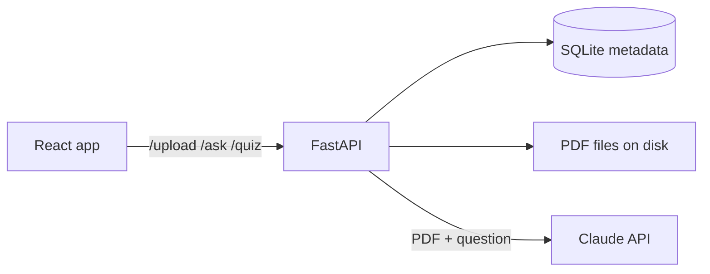

# StudyBuddy AI

I built this to study from my own lecture slides. You upload a PDF, ask questions about it, and get
answers that only use what's in the PDF, with page citations so you can check the source. It can also
quiz you with 5 multiple-choice questions generated from the notes.

Live demo: https://studybuddy-ai-liart.vercel.app

The backend runs on Render's free tier, which sleeps when idle, so the first request can take 30 to 60
seconds. The header shows "Waking server… up to 1 min" while it boots and retries on its own.

## Features

- Upload a PDF by drag and drop or the file picker (up to 10 MB / 100 pages)
- Ask questions and get answers with page chips like `p. 4` or `p. 4–5`
- Click a chip to open your PDF at that page in a new tab
- Ask follow-ups like "why?" or "give me an example" (the last 4 Q&A pairs are sent as context)
- If the notes don't cover something, it says so instead of making things up
- 5-question quiz, one question at a time, with explanations and a final score
- Works on phone and laptop, light and dark mode, keyboard accessible

<!-- Screenshots: upload screen, cited answer, quiz question, quiz results -->

## Tech stack

- Frontend: React 19, TypeScript, Vite, plain CSS, Vitest + Testing Library
- Backend: Python, FastAPI, Pydantic, pypdf, SQLite
- AI: Anthropic Python SDK with Claude Haiku 4.5 (configurable)
- Hosting: Vercel (frontend) and Render (backend)

## How it works



- Upload: the backend checks the file really is a readable PDF, saves it under a random ID, and stores
  the metadata in SQLite.
- Questions: the whole PDF goes to Claude as a document block with citations turned on. No vector
  database or chunking, since lecture notes are small enough to send in full. Claude returns text
  blocks with page citations, and `citation_parser.py` turns them into `{"parts": [{"text", "pages"}]}`
  for the frontend. Follow-ups send up to 4 earlier turns as `history`.
- Quiz: Claude is asked for strict JSON, which gets validated with Pydantic (exactly 5 questions,
  4 distinct options, and an answer that's one of the options). If it's invalid, I retry once with the
  error message. Options are shuffled because the model likes to put the right answer first.
- The API key only lives on the backend. The browser never sees it.

## Project structure

```
backend/
  app/
    routes/      thin FastAPI handlers
    services/    claude_service (all Claude calls), citation_parser, quiz_parser, storage
    schemas/     Pydantic request/response models
    db/          SQLite repository
  tests/         pytest, Claude is always mocked
frontend/
  src/
    components/  UploadCard, ChatPanel, CitationChip, QuizPanel, ...
    pages/       StudyPage (main state)
    services/    api.ts, every backend call goes through here
render.yaml      Render config for the backend
```

## Running it locally

You need Python 3.11+ and Node 20.19+.

```bash
# backend
cd backend
python3 -m venv .venv && source .venv/bin/activate
pip install -r requirements-dev.txt
cp .env.example .env        # add your ANTHROPIC_API_KEY
uvicorn app.main:app --reload --port 8000

# frontend (in another terminal)
cd frontend
npm install
cp .env.example .env.local  # VITE_API_BASE_URL=http://localhost:8000
npm run dev                 # http://localhost:5173
```

Without an API key, uploads still work and `/ask` and `/quiz` return a "not configured" error.

Tests:

```bash
cd backend && pytest -q && ruff check .
cd frontend && npm run lint && npm run typecheck && npm test && npm run build
```

## Environment variables

Backend (`backend/.env`):

| Variable | Default | Notes |
|---|---|---|
| `ANTHROPIC_API_KEY` | none | Required for questions and quizzes |
| `ANTHROPIC_MODEL` | `claude-haiku-4-5-20251001` | Needs PDF + citation support |
| `ALLOWED_ORIGINS` | `http://localhost:5173` | Comma-separated frontend URLs for CORS |
| `MAX_PDF_SIZE_MB` / `MAX_PDF_PAGES` | `10` / `100` | Upload limits |
| `MAX_QUESTION_LENGTH` | `1000` | Characters |
| `RATE_LIMIT_REQUESTS` / `RATE_LIMIT_WINDOW_SECONDS` | `10` / `60` | Per-IP limit on AI calls |

There are a few more (timeouts, token caps, storage paths) in `backend/.env.example`.

Frontend (`frontend/.env.local`): `VITE_API_BASE_URL`, the backend URL with no trailing slash. It's
baked into the build, so it has to be set before building.

## Deployment

- Backend on Render: New → Blueprint and pick this repo. `render.yaml` sets everything up, and Render
  asks for `ANTHROPIC_API_KEY` and `ALLOWED_ORIGINS`.
- Frontend on Vercel: import the repo with `frontend` as the root directory and set
  `VITE_API_BASE_URL` to the Render URL. Then add the Vercel URL to `ALLOWED_ORIGINS` on Render.

## Security

- The API key is only in the backend's environment. It's never logged or sent to the browser.
- `.env` files are gitignored.
- Uploads are stored under random IDs, and the original filename is only used for display.
- Errors come back as clean JSON without stack traces or file paths.
- CORS only allows the frontend's origin.

## What I learned

- Claude's PDF citations give `start_page_number` and `end_page_number`, and the end is exclusive. So
  a citation from page 2 comes back as 2 to 3. If you read it as inclusive, every chip shows one page
  too many. I checked this against real API responses before trusting it.
- Asking for JSON isn't the same as getting valid JSON. I validate the quiz with Pydantic and retry
  once with the exact validation error. In my testing it passed on the first try every time, but the
  retry is cheap insurance.
- Prompt caching the PDF made follow-up questions noticeably faster and cheaper (about 9k tokens read
  from cache on the second question). It only works if the cached prefix is identical, which is why
  follow-up history goes after the document instead of before it.
- Free hosting has cold starts. The header used to say "Server offline" while Render was just waking
  up, so now it shows a waking status and keeps retrying for up to 90 seconds.

## Known limitations

- Render's free disk resets on every restart or deploy, so uploaded PDFs disappear and you have to
  upload again.
- Rate limiting is in memory, so it resets on restart and wouldn't work across multiple servers.
- The whole PDF is sent with every question, which caps it at 100 pages.
- Follow-ups only see the last 4 turns.
- Chat history is lost when you refresh. There are no accounts.
- Jumping to a cited page depends on the browser's PDF viewer. Some mobile browsers open page 1.
- Answers from scanned, image-only PDFs can be less accurate.

## Future ideas

- In-app PDF.js viewer that highlights the cited passage
- Streaming answers
- Accounts and saved documents
- Multiple PDFs per session and flashcards
